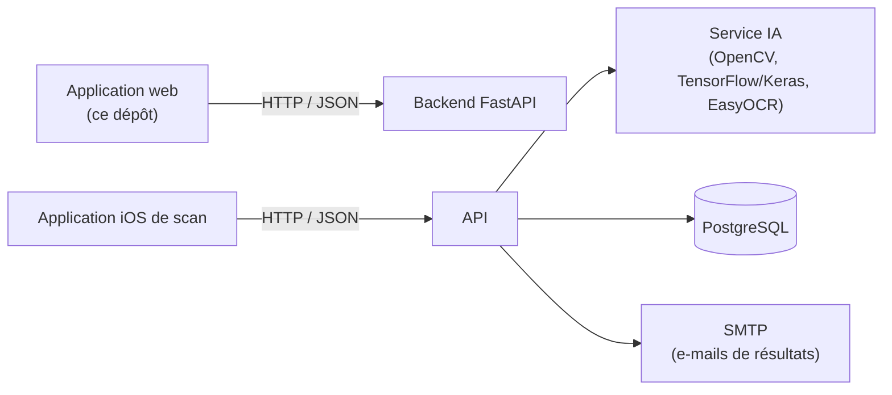

# QCM Corrector — Interface web

[English](README.md) · **Français**

Application web de **QCM Corrector**, une plateforme qui permet aux enseignants de créer des QCM (questionnaires à choix multiples), de publier des sessions de correction et de consulter les résultats produits par un pipeline de correction basé sur l'IA (vision par ordinateur + apprentissage automatique + OCR sur des feuilles de réponses numérisées).

Ce dépôt contient **l'interface web** (la partie développée par l'auteur, [Khalil Lamrabet](https://www.linkedin.com/in/khalillam12)). Elle communique avec un backend FastAPI en HTTP/JSON et n'accède jamais directement à la base de données.

> Réalisé dans le cadre d'un projet de fin d'année à 4 étudiants à Junia ISEN (2025–2026).

!\[Tableau de bord](docs/screenshots/dashboard.png)
!\[Éditeur de QCM](docs/screenshots/qcm-editor.png)
!\[Résultats d'une session](docs/screenshots/session-results.png)

## Place de ce dépôt dans le projet



Le backend, le service IA et l'application iOS **ne font pas partie** de ce dépôt.

## Équipe et contributions

QCM Corrector est un projet d'équipe. Chaque partie a été réalisée par des membres différents :

|Partie|Contributeur|Dans ce dépôt|
|-|-|-|
|**Application web** (Next.js / React / TypeScript)|**Khalil Lamrabet**|Oui|
|**Conception et implémentation de la base de données** (PostgreSQL)|**Khalil Lamrabet** (l'essentiel du travail)|Documentée dans [`docs/DATABASE.md`](docs/DATABASE.md) (en anglais)|
|Backend FastAPI (API, calcul des scores, services PDF et e-mail)|Autres membres de l'équipe|Non|
|Service de traitement d'images par IA (OpenCV, TensorFlow/Keras, EasyOCR)|Autres membres de l'équipe|Non|
|Application iOS de scan (Swift)|Autres membres de l'équipe|Non|

<!-- Ajouter ici les liens vers les dépôts ou profils de vos coéquipiers s'ils sont publics. -->

Les composants marqués « Non » ont été développés par les autres membres de l'équipe et ne sont donc pas inclus ici : pour faire fonctionner toute la plateforme, l'application web a besoin de leur backend.

## État de ce dépôt

Il s'agit d'un **instantané simplifié de l'interface web**. Il contient : le tableau de bord, la liste des QCM, l'éditeur de QCM (brouillon, sauvegarde automatique, publication), les pages de sessions et de résultats, et une vue en lecture seule des classes et des étudiants.

Certains écrans décrits dans le rapport de projet **ne font pas partie de cet instantané** : l'authentification réelle avec des rôles vérifiés par le backend, la gestion des professeurs, la création et l'import (CSV/Excel) des classes et des étudiants, les écrans de génération de PDF (sujet et grille de correction) et l'action « envoyer les résultats par e-mail ».

## Fonctionnalités

* **Tableau de bord** — nombre de sessions, de copies corrigées et de copies à vérifier manuellement, avec les dernières sessions.
* **Éditeur de QCM** — jusqu'à 60 questions à 4 choix (A–D), pondération par question, une ou plusieurs bonnes réponses, vérification de complétude en direct, sauvegarde automatique dans le navigateur (`localStorage`), *enregistrement du brouillon* et *publication* synchronisés avec le backend.
* **Liste des QCM** — filtre par statut (tous / publiés / brouillons / archivés) ; reprise du brouillon local.
* **Sessions et résultats** — synthèse par session (copies, moyenne, contrôles manuels, statut des e-mails) et détail par étudiant : score pondéré, questions correctes, réponses détectées et statut *valide / à vérifier*.
* **Vue administrateur** — classes et leurs étudiants, avec les identifiants à inscrire sur les feuilles de réponses.

## Technologies

|Domaine|Technologie|
|-|-|
|Framework|Next.js 16 (App Router), React 19|
|Langage|TypeScript (mode strict)|
|Style|Bootstrap 5 + CSS personnalisé|
|Accès aux données|API Fetch (`no-store`), client API typé dans `src/lib/api/`|
|Outils|ESLint (`eslint-config-next`)|

## Démarrage

### Prérequis

* Node.js **20.9 ou supérieur**
* Le backend FastAPI de QCM Corrector démarré et accessible (par défaut : `http://127.0.0.1:8000`)

### Lancer en local

```bash
git clone https://github.com/Xerow42/qcm-corrector-web.git
cd qcm-corrector-web

cp .env.example .env.local   # puis adapter les valeurs si besoin (Windows cmd : copy)
npm install
npm run dev
```

Ouvrir [http://localhost:3000](http://localhost:3000).

Voir [`docs/DEPLOYMENT.md`](docs/DEPLOYMENT.md) (en anglais) pour le déploiement (serveur Node.js, Vercel) et la configuration de CORS côté backend.

### Mode démo (sans backend)

Le dépôt inclut une petite API de démonstration avec des **données fictives**, pour essayer l'interface (ou faire des captures d'écran) sans le vrai backend :

```bash
npm run mock-api   # terminal 1 : API de démo sur http://127.0.0.1:8000
npm run dev        # terminal 2 : l'application web sur http://localhost:3000
```

Les données restent en mémoire : publier un QCM dans l'éditeur ajoute une session à la liste, et tout est réinitialisé à l'arrêt du serveur. C'est un outil de démonstration, pas un remplacement du vrai backend.

### Scripts

|Commande|Description|
|-|-|
|`npm run dev`|Démarre le serveur de développement|
|`npm run build`|Crée la version de production|
|`npm start`|Sert la version de production|
|`npm run lint`|Analyse le code avec ESLint|
|`npm run typecheck`|Vérifie les types avec TypeScript|
|`npm run check:secrets`|Recherche des données sensibles avant publication|
|`npm run mock-api`|Démarre l'API de démo avec des données fictives (sans backend)|

## Configuration

|Variable|Valeur par défaut|Description|
|-|-|-|
|`NEXT\_PUBLIC\_API\_URL`|`http://127.0.0.1:8000`|URL de base de l'API backend|
|`NEXT\_PUBLIC\_DEMO\_TEACHER\_EMAIL`|`teacher@example.com`|E-mail de l'enseignant prérempli dans le formulaire « Nouveau QCM » (doit exister dans votre backend)|
|`NEXT\_PUBLIC\_DEMO\_TEACHER\_ID`|`1`|Identifiant de l'enseignant prérempli dans le formulaire « Nouveau QCM »|

## API backend utilisée

|Méthode|Route|Utilisée pour|
|-|-|-|
|`GET`|`/api/sessions`|Tableau de bord, liste des QCM, liste des sessions|
|`GET`|`/api/sessions/{id}/results`|Résultats d'une session|
|`GET`|`/api/admin/classes`|Classes et étudiants|
|`POST`|`/api/qcms/draft`|Enregistrer un brouillon de QCM|
|`POST`|`/api/qcms/sync`|Publier un QCM (crée la session)|

Les types des requêtes et des réponses se trouvent dans [`src/types/`](src/types) et le code client dans [`src/lib/api/`](src/lib/api).

## Architecture

Le code suit une organisation simple en couches, orientée fonctionnalités. Les dépendances ne vont que vers le bas :

```text
app/ (routes)  →  features/ + components/  →  hooks/ + lib/  →  types/
```

* **`app/`** ne contient que le routage : chaque page assemble des composants et des hooks et contient très peu de logique.
* **`features/`** contient le code métier d'un domaine (`qcm`, `sessions`) : composants, hooks, validation, stockage, constantes.
* **`components/`** contient l'interface réutilisable, indépendante des fonctionnalités (mise en page, badges, cartes de métriques, cartes de connexion).
* **`hooks/`** et **`lib/`** contiennent le code technique partagé : client API, configuration, formatage, `useApi`.
* **`types/`** contient les types TypeScript partagés qui décrivent le contrat avec le backend.

## Structure du projet

```text
.
├── src/
│   ├── app/                       # Routes (Next.js App Router)
│   │   ├── layout.tsx             # Structure HTML + barre du haut
│   │   ├── page.tsx               # Tableau de bord
│   │   ├── globals.css
│   │   ├── login/                 # Écrans de connexion (interface seule)
│   │   ├── qcms/                  # Liste des QCM, éditeur (new), page du sujet
│   │   ├── sessions/              # Liste des sessions et résultats
│   │   └── admin/classes/         # Classes et étudiants
│   ├── features/
│   │   ├── qcm/                   # Éditeur : composants, hooks, validation, stockage, lignes
│   │   └── sessions/              # Fonctions d'affichage des résultats
│   ├── components/                # Interface partagée : layout/, ui/, auth/
│   ├── hooks/useApi.ts            # Hook de chargement des données
│   ├── lib/
│   │   ├── api/                   # Client HTTP + routes (sessions, classes, qcms)
│   │   ├── config.ts              # Configuration par variables d'environnement
│   │   └── format.ts              # Fonctions de formatage
│   ├── config/site.ts             # Identité visuelle et navigation
│   └── types/                     # Types partagés (qcm, session, school)
├── docs/                          # DATABASE.md (MCD/MLD), DEPLOYMENT.md
├── database/                      # Scripts PostgreSQL (à ajouter)
├── public/                        # Fichiers statiques
├── scripts/                       # check-secrets.mjs, mock-api.mjs (API de démo)
├── .env.example
└── package.json
```

## Sécurité

* **Aucun secret dans le dépôt.** La configuration vient des variables d'environnement ; seul `.env.example` (valeurs factices) est suivi, et les fichiers `.env\*` sont ignorés par Git.
* **Analyse avant chaque envoi.** `npm run check:secrets` échoue s'il détecte des mots de passe ou jetons écrits en dur, des clés privées, des identifiants dans des URL, des adresses e-mail réelles, des adresses IP privées, ou des fichiers comme `.env`, des clés, des dumps de base de données et des archives. Il n'affiche jamais le secret lui-même. Sur GitHub, activez aussi *Secret scanning* et *Push protection* (Settings → Code security).
* **Les variables `NEXT\_PUBLIC\_\*` sont publiques.** Elles sont intégrées au code envoyé au navigateur. N'y placez jamais de secret.
* **Les détails d'erreur du serveur ne sont pas affichés.** Le client API affiche un court message (champ `detail` de FastAPI ou code de statut) au lieu du contenu brut de la réponse.
* **Paramètres renforcés.** L'application définit les en-têtes `X-Content-Type-Options`, `X-Frame-Options`, `Referrer-Policy` et `Permissions-Policy`, supprime `X-Powered-By` et demande aux moteurs de recherche de ne pas l'indexer.
* **Les brouillons restent dans le navigateur.** Le QCM en cours, bonnes réponses comprises, est stocké non chiffré dans le `localStorage` de l'enseignant. Utilisez *Annuler* pour l'effacer sur un ordinateur partagé.
* **L'authentification ne fait pas partie de ce dépôt.** Les écrans de connexion sont statiques, et l'identité de l'enseignant envoyée à l'enregistrement d'un QCM provient de la configuration. Le backend doit authentifier les utilisateurs et déduire l'enseignant de la session, sans faire confiance au client.

Si un secret est publié par erreur, révoquez-le et changez-le immédiatement : le supprimer dans un commit ultérieur ne l'efface pas de l'historique Git.

## Limites connues

* Les écrans de connexion sont **de l'interface seule** : aucun identifiant n'est vérifié dans ce dépôt, et les boutons « Entrer » sont de simples liens.
* La page *Sujet PDF* est un espace réservé ; l'impression passe par le navigateur (`Ctrl+P`).
* L'interface est en français, sans caractères accentués.
* Il n'y a pas encore de tests automatisés.

