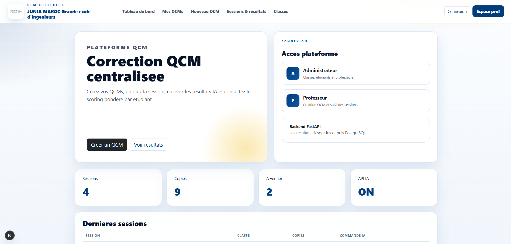
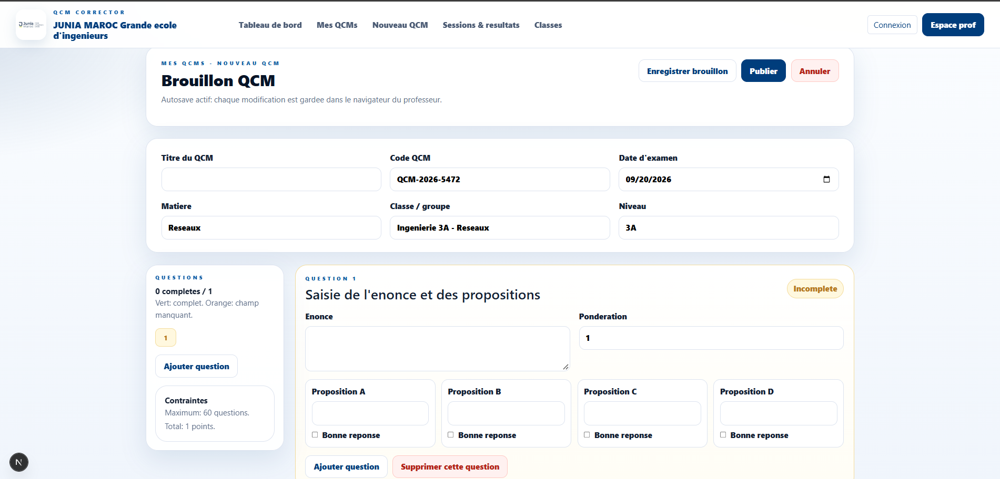
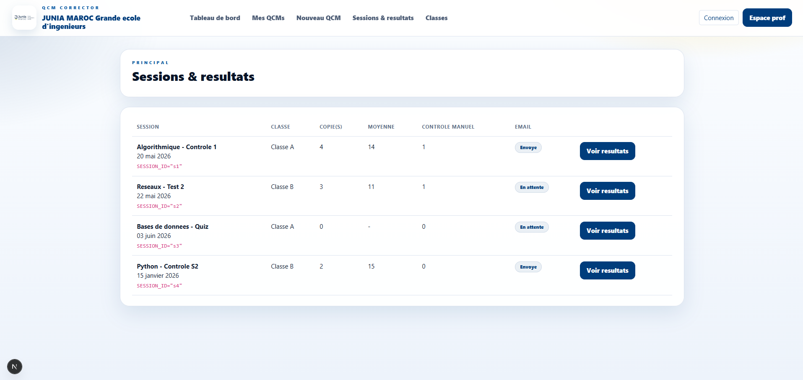
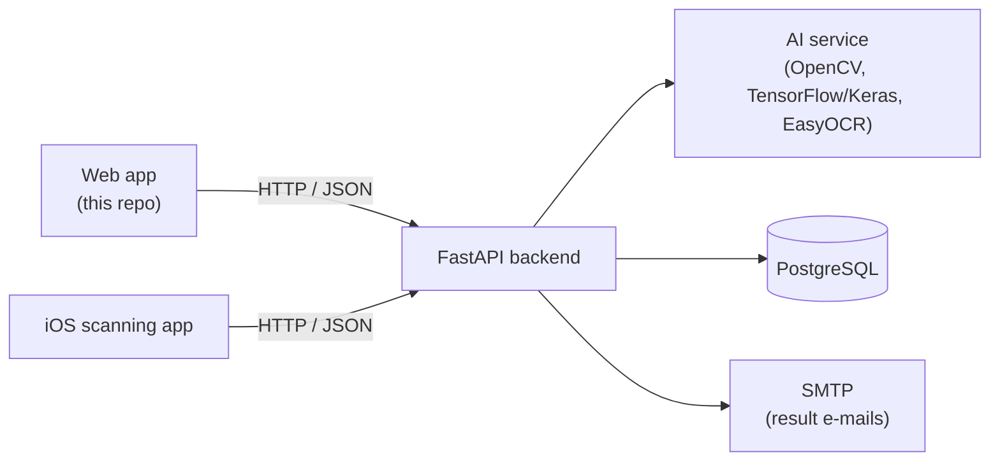

# QCM Corrector — Web front-end

**English** · [Français](README.fr.md)

Web application of **QCM Corrector**, a platform that lets teachers create multiple-choice exams (QCM), publish correction sessions, and review the results produced by an AI-based grading pipeline (computer vision + machine learning + OCR on scanned answer sheets).

This repository contains **the web front-end** (the part built by the author, [Khalil Lamrabet](https://www.linkedin.com/in/khalillam12)). It talks to a FastAPI backend over HTTP/JSON and never accesses the database directly.

> Built as part of a 4-student end-of-year project at Junia ISEN (2025–2026).

<!--
Add screenshots here once you have them, e.g.:



-->

## Where this repo fits



The backend, the AI service and the iOS app are **not** part of this repository.

## Team and contributions

QCM Corrector is a team project. Each part was built by different members:

| Part | Contributor | In this repo |
| --- | --- | --- |
| **Web application** (Next.js / React / TypeScript) | **Khalil Lamrabet** | Yes |
| **Database design and implementation** (PostgreSQL) | **Khalil Lamrabet** (most of the work) | Documented in [`docs/DATABASE.md`](docs/DATABASE.md) |
| FastAPI backend (API, scoring, PDF and e-mail services) | Other members of the team | No |
| AI image-processing service (OpenCV, TensorFlow/Keras, EasyOCR) | Other members of the team | No |
| iOS scanning application (Swift) | Other members of the team | No |

<!-- Add links to your teammates' repositories or profiles here if they are public. -->

The components marked "No" were developed by the other members of the team and are therefore not included here: to run the whole
platform, the web application needs their backend.

## Status of this repository

This is a **simplified snapshot of the web front-end**. It contains: the dashboard, the MCQ list, the MCQ editor
(draft, autosave, publication), the sessions and results pages, and a read-only classes and students view.

Some screens described in the project report are **not part of this snapshot**: real authentication with backend-checked roles,
professor management, creation and import (CSV/Excel) of classes and students, the PDF generation screens
(subject and correction grid) and the "send results by e-mail" action.

## Features

- **Dashboard** — number of sessions, graded copies and copies needing manual review, plus the latest sessions.
- **MCQ editor** — up to 60 questions with 4 choices (A–D), per-question weighting, single or multiple correct answers, live completeness check, autosave in the browser (`localStorage`), *save draft* and *publish* synchronised with the backend.
- **MCQ list** — filter by status (all / published / draft / archived); resume the local draft.
- **Sessions & results** — per-session summary (copies, average score, manual checks, e-mail status) and per-student detail: weighted score, correct questions, detected answers, and a *valid / to check* status.
- **Admin view** — classes and their students, including the student identifiers to write on the answer sheets.

## Tech stack

| Area | Technology |
| --- | --- |
| Framework | Next.js 16 (App Router), React 19 |
| Language | TypeScript (strict mode) |
| Styling | Bootstrap 5 + custom CSS |
| Data fetching | Fetch API (`no-store`), typed API client in `src/lib/api/` |
| Tooling | ESLint (`eslint-config-next`) |

## Getting started

### Prerequisites

- Node.js **20.9 or later**
- The QCM Corrector FastAPI backend running and reachable (default: `http://127.0.0.1:8000`)

### Run locally

```bash
git clone https://github.com/Xerow42/qcm-corrector-web.git
cd qcm-corrector-web

cp .env.example .env.local   # then edit the values if needed
npm install
npm run dev
```

Open <http://localhost:3000>.

See [`docs/DEPLOYMENT.md`](docs/DEPLOYMENT.md) to deploy it (Node.js server, Vercel) and to configure CORS on the backend.

### Scripts

| Command | Description |
| --- | --- |
| `npm run dev` | Start the development server |
| `npm run build` | Create a production build |
| `npm start` | Serve the production build |
| `npm run lint` | Lint the code with ESLint |
| `npm run typecheck` | Type-check the project with TypeScript |
| `npm run check:secrets` | Scan the project for sensitive data before publishing |

## Configuration

| Variable | Default | Description |
| --- | --- | --- |
| `NEXT_PUBLIC_API_URL` | `http://127.0.0.1:8000` | Base URL of the backend API |
| `NEXT_PUBLIC_DEMO_TEACHER_EMAIL` | `teacher@example.com` | Teacher e-mail pre-filled in the "New MCQ" form (must exist in your backend) |
| `NEXT_PUBLIC_DEMO_TEACHER_ID` | `1` | Teacher id pre-filled in the "New MCQ" form |

## Backend API used

| Method | Endpoint | Used for |
| --- | --- | --- |
| `GET` | `/api/sessions` | Dashboard, MCQ list, sessions list |
| `GET` | `/api/sessions/{id}/results` | Session results |
| `GET` | `/api/admin/classes` | Classes and students |
| `POST` | `/api/qcms/draft` | Save an MCQ draft |
| `POST` | `/api/qcms/sync` | Publish an MCQ (creates the session) |

Request and response types live in [`src/types/`](src/types) and the client code in [`src/lib/api/`](src/lib/api).

## Architecture

The code follows a simple layered, feature-oriented layout. Dependencies only point downwards:

```text
app/ (routes)  →  features/ + components/  →  hooks/ + lib/  →  types/
```

- **`app/`** contains routing only: each page composes components and hooks and holds almost no logic.
- **`features/`** holds the domain code of one area (`qcm`, `sessions`): components, hooks, validation, storage, constants.
- **`components/`** holds reusable, feature-agnostic UI (layout, badges, metric cards, login cards).
- **`hooks/`** and **`lib/`** hold shared technical code: the API client, configuration, formatting, `useApi`.
- **`types/`** holds the shared TypeScript types describing the backend contract.

## Project structure

```text
.
├── src/
│   ├── app/                       # Routes (Next.js App Router)
│   │   ├── layout.tsx             # HTML shell + top bar
│   │   ├── page.tsx               # Dashboard
│   │   ├── globals.css
│   │   ├── login/                 # Login screens (UI only)
│   │   ├── qcms/                  # MCQ list, editor (new), subject page
│   │   ├── sessions/              # Sessions list and results
│   │   └── admin/classes/         # Classes and students
│   ├── features/
│   │   ├── qcm/                   # Editor: components, hooks, validation, storage, rows
│   │   └── sessions/              # Result formatting helpers
│   ├── components/                # Shared UI: layout/, ui/, auth/
│   ├── hooks/useApi.ts            # Data-loading hook
│   ├── lib/
│   │   ├── api/                   # HTTP client + endpoints (sessions, classes, qcms)
│   │   ├── config.ts              # Environment configuration
│   │   └── format.ts              # Formatting helpers
│   ├── config/site.ts             # Branding and navigation
│   └── types/                     # Shared types (qcm, session, school)
├── docs/                          # DATABASE.md (MCD/MLD), DEPLOYMENT.md
├── database/                      # PostgreSQL scripts (add yours here)
├── public/                        # Static assets
├── scripts/check-secrets.mjs      # Sensitive-data guard
├── .env.example
└── package.json
```

## Security

- **No secrets in the repository.** Configuration comes from environment variables; only `.env.example` (placeholders) is tracked, and `.env*` files are git-ignored.
- **Scan before every push.** `npm run check:secrets` fails if it finds hard-coded passwords or tokens, private keys, credentials in URLs, real-looking e-mail addresses, private IPs, or files such as `.env`, keys, database dumps and archives. It never prints the secret itself. On GitHub, also enable *Secret scanning* and *Push protection* (Settings → Code security).
- **`NEXT_PUBLIC_*` variables are public.** They are embedded in the browser bundle. Never store a secret in them.
- **Server error details are not displayed.** The API client shows a short message (FastAPI's `detail` field or a status code) instead of the raw response body.
- **Hardened defaults.** The app sets `X-Content-Type-Options`, `X-Frame-Options`, `Referrer-Policy` and `Permissions-Policy` headers, removes `X-Powered-By`, and asks search engines not to index it.
- **Drafts stay in the browser.** The in-progress MCQ, including correct answers, is stored unencrypted in the teacher's `localStorage`. Use *Cancel* to clear it on shared computers.
- **Authentication is not part of this repo.** The login screens are static, and the teacher identity sent when saving an MCQ comes from configuration. The backend must authenticate users and derive the teacher from the session, not trust the client.

If a secret is ever committed by mistake, revoke and rotate it immediately: deleting it in a later commit does not remove it from the Git history.

## Known limitations

- The login screens are **UI only**: no credentials are checked in this repository, and the "Enter" buttons are plain links.
- The *Subject PDF* page is a placeholder; printing relies on the browser (`Ctrl+P`).
- The interface is in French, without accented characters.
- There are no automated tests yet.
