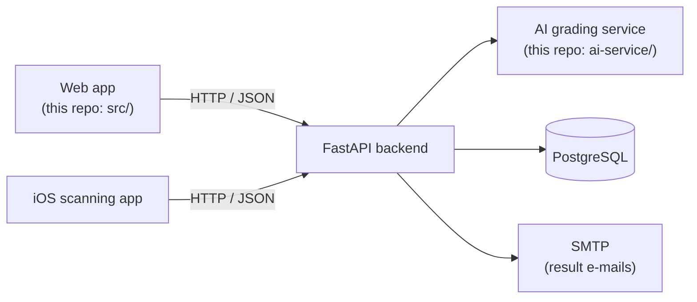

# QCM Corrector
## Dashboard


**English** · [Français](README.fr.md)

Web application of **QCM Corrector**, a platform that lets teachers create multiple-choice exams (QCM), publish correction sessions, and review the results produced by an AI-based grading pipeline (computer vision + machine learning + OCR on scanned answer sheets).

This repository contains **the web front-end** and the **AI grading service** (see below for who built which part). The web app talks to a FastAPI backend over HTTP/JSON and never accesses the database directly; the AI service is called by that backend, not by the web app.

> Built as part of a 4-student end-of-year project at Junia ISEN (2025–2026).

<!--
Add screenshots here once you have them, e.g.:


-->

## Where this repo fits


```mermaid
flowchart LR
    Web["Web app<br/>(this repo: src/)"] -- "HTTP / JSON" --> API["FastAPI backend"]
    iOS["iOS scanning app"] -- "HTTP / JSON" --> API
    API --> AI["AI grading service<br/>(this repo: ai-service/)"]
    API --> DB[("PostgreSQL")]
    API --> Mail["SMTP<br/>(result e-mails)"]
```

The backend and the iOS app are **not** part of this repository. The web app and the AI service are both here, but
they are independent: the web app does not call the AI service directly (the backend sits between them), so adding
the AI service to this repository does not change what the deployed web app does.

## Team and contributions

QCM Corrector is a team project. Each part was built by different members:

| Part | Contributor | In this repo |
| --- | --- | --- |
| **Web application** (Next.js / React / TypeScript) | **Khalil Lamrabet** | Yes — [`src/`](src) |
| **Database design and implementation** (PostgreSQL) | **Khalil Lamrabet** (most of the work) | Documented in [`docs/DATABASE.md`](docs/DATABASE.md) |
| **AI grading service** (OpenCV, TensorFlow/Keras, EasyOCR) | Other members of the team, built the service and trained the classification models; **Khalil Lamrabet** participated in training the models on the answer-sheet dataset | Yes — [`ai-service/`](ai-service) |
| FastAPI backend (API, scoring, PDF and e-mail services) | Other members of the team | No |
| iOS scanning application (Swift) | Other members of the team | No |

<!-- Add links to your teammates' repositories or profiles here if they are public. -->

The backend and the iOS app (marked "No" above) were developed by other members of the team and are not included here: to run the whole platform end to end, the web app still needs their backend.

## Status of this repository

This is a **simplified snapshot of the web front-end**, plus the AI grading service. The web app contains: the dashboard, the MCQ list, the MCQ editor
(draft, autosave, publication), the sessions and results pages, and a read-only classes and students view.

Some screens described in the project report are **not part of this snapshot**: real authentication with backend-checked roles,
professor management, creation and import (CSV/Excel) of classes and students, the PDF generation screens
(subject and correction grid) and the "send results by e-mail" action.

The AI service (see below) has not been run end to end in the environment used to prepare this repository (no network
access to install TensorFlow/EasyOCR there); its Python source was verified to compile and its two model files were
verified to be valid, but it should be tested locally before you rely on it.

## AI grading service

[`ai-service/`](ai-service) is a standalone FastAPI service that takes a photo of a scanned answer sheet and returns
the detected student name, student number and answers for up to 60 questions, using OpenCV for image processing,
two TensorFlow/Keras models for checkbox classification, and EasyOCR for the name field. It was built primarily by
other members of the team; I participated in training the classification models on the answer-sheet dataset.

It is **not called by the web app in this repository** — in the full platform it sits behind the FastAPI backend,
which is not included here. See [`ai-service/README.md`](ai-service/README.md) for how it works, how to run it, and
why it is not a fit for Vercel's serverless functions (it needs OS-level libraries and keeps two models loaded in
memory, which means it needs a small VM or a host like Render, Railway, Fly.io or a Hugging Face Space instead).

## Features

- **Dashboard** — number of sessions, graded copies and copies needing manual review, plus the latest sessions.
- **QCM editor** — up to 60 questions with 4 choices (A–D), per-question weighting, single or multiple correct answers, live completeness check, autosave in the browser (`localStorage`), *save draft* and *publish* synchronised with the backend.
- **QCM list** — filter by status (all / published / draft / archived); resume the local draft.
- **Sessions & results** — per-session summary (copies, average score, manual checks, e-mail status) and per-student detail: weighted score, correct questions, detected answers, and a *valid / to check* status.
- **Admin view** — classes and their students, including the student identifiers to write on the answer sheets.
## QCM CREATION


## Tech stack

## QCM RESULTS


| Area | Technology |
| --- | --- |
| Framework | Next.js 16 (App Router), React 19 |
| Language | TypeScript (strict mode) |
| Styling | Bootstrap 5 + custom CSS |
| Data fetching | Fetch API (`no-store`), typed API client in `src/lib/api/` |
| Tooling | ESLint (`eslint-config-next`) |

## Getting started

### Prerequisites

- Node.js **20.9 or later**
- The QCM Corrector FastAPI backend running and reachable (default: `http://127.0.0.1:8000`)

### Run locally

```bash
git clone https://github.com/Xerow42/qcm-corrector-web.git
cd qcm-corrector-web

cp .env.example .env.local   # then edit the values if needed
npm install
npm run dev
```

Open <http://localhost:3000>.

See [`docs/DEPLOYMENT.md`](docs/DEPLOYMENT.md) to deploy it (Node.js server, Vercel) and to configure CORS on the backend.

### Demo mode (no backend needed)

The repository includes a small demo API with **fictitious data**, so you can try the interface (or take screenshots) without the real backend:

```bash
npm run mock-api   # terminal 1: demo API on http://127.0.0.1:8000
npm run dev        # terminal 2: the web app on http://localhost:3000
```

The data lives in memory only: publishing an MCQ in the editor adds a session to the list, and everything resets when you stop the server. It is a demo tool, not a replacement for the real backend.

### Scripts

| Command | Description |
| --- | --- |
| `npm run dev` | Start the development server |
| `npm run build` | Create a production build |
| `npm start` | Serve the production build |
| `npm run lint` | Lint the code with ESLint |
| `npm run typecheck` | Type-check the project with TypeScript |
| `npm run check:secrets` | Scan the project for sensitive data before publishing |
| `npm run mock-api` | Start the demo API with fictitious data (no backend needed) |

## Configuration

| Variable | Default | Description |
| --- | --- | --- |
| `NEXT_PUBLIC_API_URL` | `http://127.0.0.1:8000` | Base URL of the backend API |
| `NEXT_PUBLIC_DEMO_TEACHER_EMAIL` | `teacher@example.com` | Teacher e-mail pre-filled in the "New MCQ" form (must exist in your backend) |
| `NEXT_PUBLIC_DEMO_TEACHER_ID` | `1` | Teacher id pre-filled in the "New MCQ" form |

## Backend API used

| Method | Endpoint | Used for |
| --- | --- | --- |
| `GET` | `/api/sessions` | Dashboard, MCQ list, sessions list |
| `GET` | `/api/sessions/{id}/results` | Session results |
| `GET` | `/api/admin/classes` | Classes and students |
| `POST` | `/api/qcms/draft` | Save an MCQ draft |
| `POST` | `/api/qcms/sync` | Publish an MCQ (creates the session) |

Request and response types live in [`src/types/`](src/types) and the client code in [`src/lib/api/`](src/lib/api).

## Architecture

The code follows a simple layered, feature-oriented layout. Dependencies only point downwards:

```text
app/ (routes)  →  features/ + components/  →  hooks/ + lib/  →  types/
```

- **`app/`** contains routing only: each page composes components and hooks and holds almost no logic.
- **`features/`** holds the domain code of one area (`qcm`, `sessions`): components, hooks, validation, storage, constants.
- **`components/`** holds reusable, feature-agnostic UI (layout, badges, metric cards, login cards).
- **`hooks/`** and **`lib/`** hold shared technical code: the API client, configuration, formatting, `useApi`.
- **`types/`** holds the shared TypeScript types describing the backend contract.

## Project structure

```text
.
├── src/
│   ├── app/                       # Routes (Next.js App Router)
│   │   ├── layout.tsx             # HTML shell + top bar
│   │   ├── page.tsx               # Dashboard
│   │   ├── globals.css
│   │   ├── login/                 # Login screens (UI only)
│   │   ├── qcms/                  # MCQ list, editor (new), subject page
│   │   ├── sessions/              # Sessions list and results
│   │   └── admin/classes/         # Classes and students
│   ├── features/
│   │   ├── qcm/                   # Editor: components, hooks, validation, storage, rows
│   │   └── sessions/              # Result formatting helpers
│   ├── components/                # Shared UI: layout/, ui/, auth/
│   ├── hooks/useApi.ts            # Data-loading hook
│   ├── lib/
│   │   ├── api/                   # HTTP client + endpoints (sessions, classes, qcms)
│   │   ├── config.ts              # Environment configuration
│   │   └── format.ts              # Formatting helpers
│   ├── config/site.ts             # Branding and navigation
│   └── types/                     # Shared types (qcm, session, school)
├── docs/                          # DATABASE.md (MCD/MLD), DEPLOYMENT.md
├── database/                      # PostgreSQL scripts (add yours here)
├── public/                        # Static assets
├── scripts/                       # check-secrets.mjs, mock-api.mjs (demo API)
├── .env.example
├── package.json
└── ai-service/                    # AI grading service (Python/FastAPI) — see ai-service/README.md
    ├── api_qcm/                   # app.py, service.py, models, box coordinates
    ├── docs/                      # API contracts (web + iOS)
    ├── requirements.txt / requirements-training.txt
    └── run_api.py
```

## Security

- **No secrets in the repository.** Configuration comes from environment variables; only `.env.example` (placeholders) is tracked, and `.env*` files are git-ignored.
- **Scan before every push.** `npm run check:secrets` fails if it finds hard-coded passwords or tokens, private keys, credentials in URLs, real-looking e-mail addresses, private IPs, or files such as `.env`, keys, database dumps and archives. It never prints the secret itself. On GitHub, also enable *Secret scanning* and *Push protection* (Settings → Code security).
- **`NEXT_PUBLIC_*` variables are public.** They are embedded in the browser bundle. Never store a secret in them.
- **Server error details are not displayed.** The API client shows a short message (FastAPI's `detail` field or a status code) instead of the raw response body.
- **Hardened defaults.** The app sets `X-Content-Type-Options`, `X-Frame-Options`, `Referrer-Policy` and `Permissions-Policy` headers, removes `X-Powered-By`, and asks search engines not to index it.
- **Drafts stay in the browser.** The in-progress MCQ, including correct answers, is stored unencrypted in the teacher's `localStorage`. Use *Cancel* to clear it on shared computers.
- **Authentication is not part of this repo.** The login screens are static, and the teacher identity sent when saving an MCQ comes from configuration. The backend must authenticate users and derive the teacher from the session, not trust the client.

If a secret is ever committed by mistake, revoke and rotate it immediately: deleting it in a later commit does not remove it from the Git history.

## Known limitations

- The login screens are **UI only**: no credentials are checked in this repository, and the "Enter" buttons are plain links.
- The *Subject PDF* page is a placeholder; printing relies on the browser (`Ctrl+P`).
- The interface is in French, without accented characters.
- There are no automated tests yet for the web app.
- The AI service (`ai-service/`) has not been run end to end in the environment used to prepare this repository; see [`ai-service/README.md`](ai-service/README.md) for exactly what was and was not verified.
- The web app does not call the AI service: there is no code path between them in this repository, and the FastAPI backend that would normally sit between them is not included.
