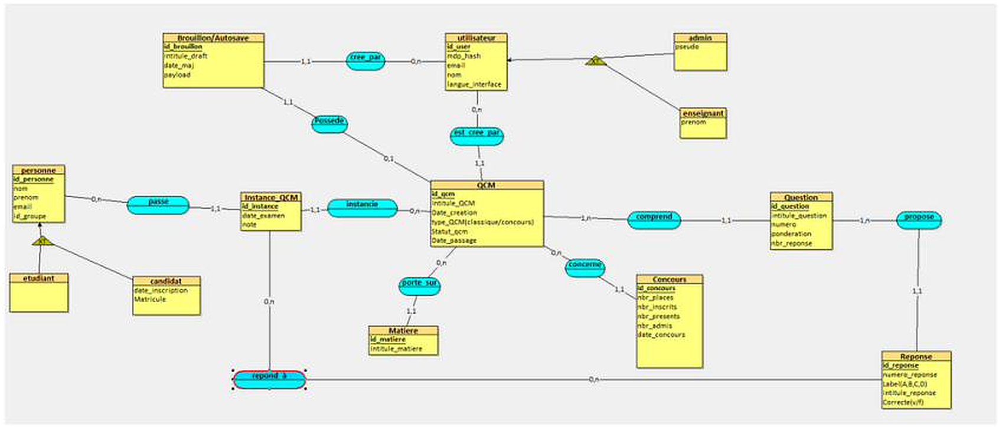
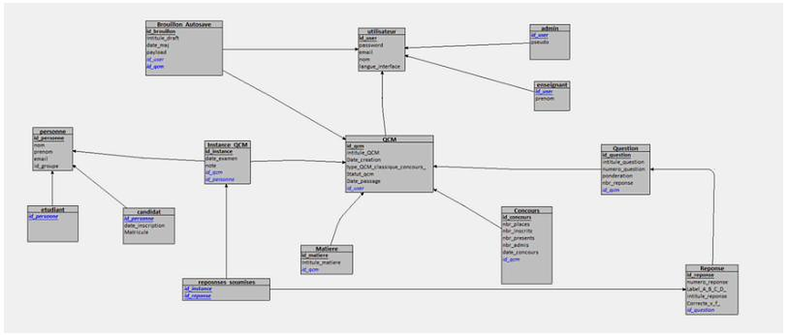

# Database design

> Most of the database design and implementation of QCM Corrector was done by the author of this repository.
> The schema below is the design documented in the project report (PostgreSQL).
> This repository contains the web front-end only, which **never connects to the database directly**:
> every read and write goes through the backend API.

## 1. Needs analysis

Actors identified from the specifications:

- **Administrator** — manages users and reference data.
- **Teacher** — creates and administers MCQs.
- **Student** — takes the assessments.
- **Candidate** — takes competitive-exam style assessments.

Main features the model has to support: user accounts, MCQ creation and management, subjects, competitive exams,
questions and answers, automatic saving of drafts, and tracking of MCQ sessions.

## 2. Conceptual model (MCD)

### Entities

| Entity | Main attributes |
| --- | --- |
| `Utilisateur` | id, e-mail, password hash, name, interface language |
| `Admin` (specialises `Utilisateur`) | pseudo |
| `Enseignant` (specialises `Utilisateur`) | first name |
| `Personne` | id, last name, first name, e-mail, group |
| `Etudiant` (specialises `Personne`) | — |
| `Candidat` (specialises `Personne`) | registration date, registration number |
| `Matiere` | id, subject title |
| `QCM` | id, title, creation date, type (classic / competitive exam), status, exam date |
| `Concours` | id, places, registered, present, admitted, exam date |
| `Question` | id, statement, number, weighting, number of answers |
| `Reponse` | id, number, label (A, B, C, D), text, correct (true / false) |
| `Brouillon / Autosave` | id, draft title, last update, payload |
| `Instance_QCM` | id, exam date, grade |

### Associations

- A user can create several MCQs; an MCQ has exactly one main author.
- An MCQ is made of several questions; each question belongs to a single MCQ.
- A question has several answers; an answer belongs to exactly one question.
- Each MCQ is about one subject and, for the competitive-exam type, may be linked to a competition.
- A person can take part in several sessions, represented by `Instance_QCM`; the answers given during a session are recorded.
- The autosave entity keeps intermediate drafts and is linked to a user and to an MCQ.

### Modelling choices

Two inheritance mechanisms limit redundancy:

- **User inheritance** — the attributes common to people with platform access (identifier, e-mail, password hash, interface preferences) live in `Utilisateur`, specialised into `Admin` and `Enseignant`.
- **Person inheritance** — the attributes shared by people who take assessments (name, first name, e-mail, group) live in `Personne`, specialised into `Etudiant` and `Candidat`.

## 3. Logical model (MLD)

Every entity became a relational table, and associations became foreign keys, or a dedicated table when the cardinalities required it (the
many-to-many link between sessions and answers gives the `reponses_soumises` table).

Tables: `utilisateur`, `admin`, `enseignant`, `personne`, `etudiant`, `candidat`, `matiere`, `qcm`, `concours`, `question`,
`reponse`, `brouillon`, `instance_qcm`, `reponses_soumises`.

## 4. Integrity constraints and business rules

### Constraints

- primary keys identify every record;
- foreign keys keep relations consistent;
- uniqueness constraints on sensitive data such as e-mail addresses;
- validation constraints on some business attributes.

### Rules enforced

- a teacher can create several MCQs, and an MCQ has a single main author;
- an MCQ belongs to one subject and may be linked to a competition;
- a question belongs to one MCQ, and an answer to one question;
- a draft is linked to one user and one MCQ;
- a published MCQ becomes locked once the exam date is reached;
- administrators have a global view of the platform data.

## 5. Implementation

The model was implemented in **PostgreSQL** with SQL scripts that create the tables, primary keys, foreign keys and integrity constraints.

## 6. Relationship with the web application

The web front-end consumes a JSON API (see the README) that also exposes **classes, students (with a student number),
correction sessions and graded results**. Those objects are not drawn in the design-time MCD/MLD above.
Check the final SQL scripts for the exact implemented schema.
